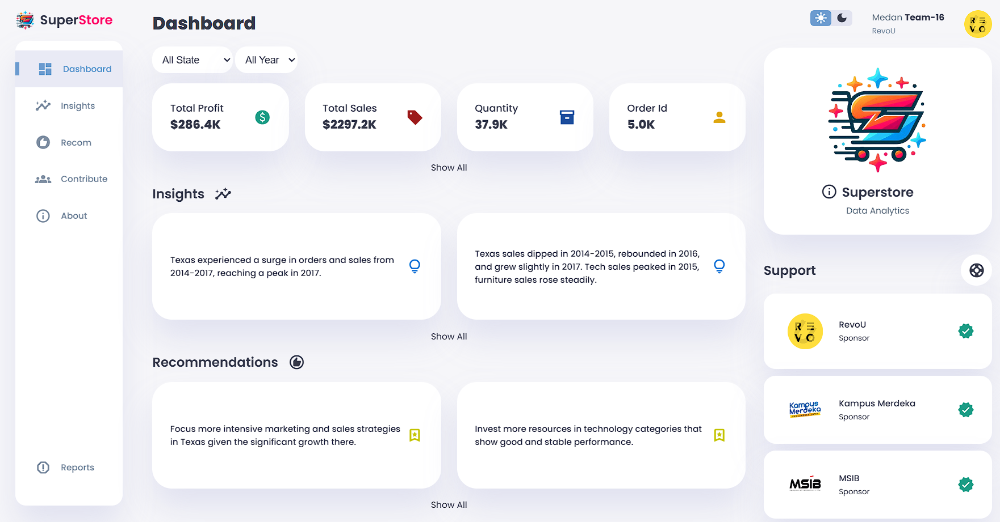

# Dashboard - Web Project

## Description
Dashboard-WebProject is a web application for visualizing superstore data. The project uses modern web technologies to display data in an interactive and easy-to-understand manner.

## Features
- Interactive data visualization
- Graphs and charts using Chart.js
- Responsive design
- Easy to use

## Screenshot


## Installation
Here are the steps to install this project on your computer:

1. Clone this repository:
   ```bash
   git clone https://github.com/username/Dashboard-WebProject.git
2. Open the project folder:
   ```bash
   cd Dashboard-WebProjec
3. Open the file "index.html" in your browser.

## Usage
Once the project is opened in the browser, you can start using the dashboard for just browsing or whatever.

## Project Structure

- .vscode/: Settings for Visual Studio Code.
- images/: Folder for images used in the project.
- dataset.json: JSON file containing data to display in the dashboard.
- index.html: The main HTML file.
- index.js: The main JavaScript file.
- myChart.js: JavaScript file to handle charts.
- style.css: CSS file for styling.

## Contribution
If you would like to contribute to this project, please follow these steps:

1. Fork this repository.
2. Create a new branch: git checkout -b feature-new.
3. Make changes and commit: git commit -m 'Added new feature'.
4. Push to branch: git push origin feature-new.
5. Create a pull request.

## License
**Is it Free?, Hell nah!**

## Dataset
https://www.kaggle.com/datasets/vivek468/superstore-dataset-final

## Kontak
If you have any questions, please contact me at [khiasannya@gmail.com].
